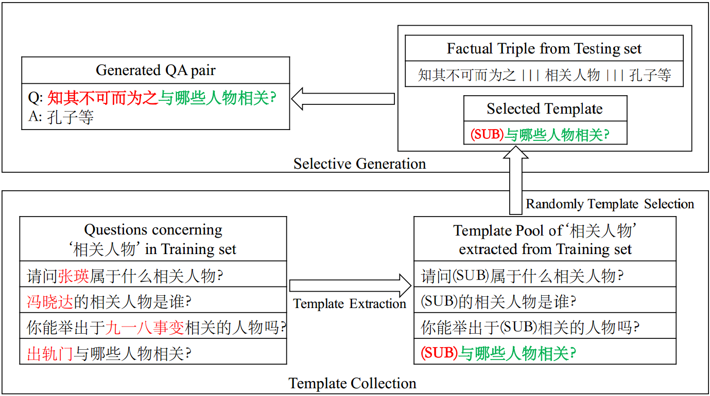
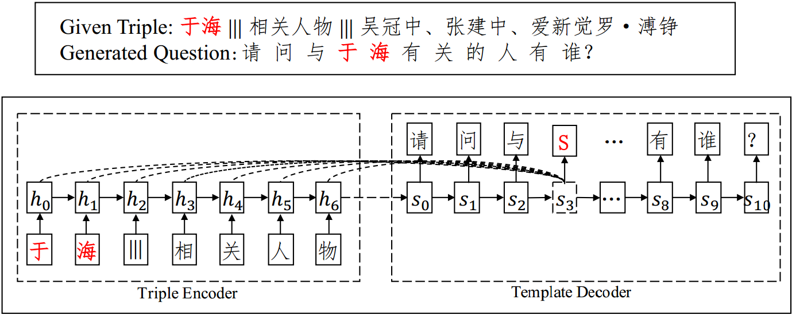

# ChineseQG
This project includes two ways to generate simple questions based on RDF triples in the knowledge base, template extraction method and template based sequence-to-sequence(seq2seq) model.

## Model Overview

### Template Extraction
<p align="center"></p>
As shown above, we extract templates for a specific predicate ("相关人物"/related people in this case) from training set. Then we randomly select one of those extracted templates to generate new questions of the given triples from testing set.   

### Template-based Seq2seq
<p align="center"></p>
For a given triple, the input for triple encoder is the concatenation of (SUBJECT, SEP, PREDICT). SEP here is '|||'.

For template decoder, instead of using the entire question for input, we replace the SUBJECT(topic words) in the question with '(SUB)' token. 

## Installation
For training tseq2seq, we strongly recommend using GPU for accelerating the speed.

### Tensorflow
The code for tseq2seq is based on Tensorflow. You can find installation instructions [here](https://www.tensorflow.org/).

### Dependencies
The code is based on Python 2.7. The dependencies are listed in the file ```requirements.txt```. You can install these dependencies as follows:
```
pip install -r requirements.txt
```

### Data
We focus on Chinese simple question generation based on open-domain Chinese knowledge base provided by [NLPCC 2017 Shared Task 5](http://tcci.ccf.org.cn/conference/2017/taskdata.php). The training file ```nlpcc-iccpol-2016.kbqa.training-data``` in our experiments is from the KBQA challenge.

## Format
KB-based simple questions are the questions which only involve one-hop inference on the knowledge graph. In other words, we generate simple questions in this work only by single triples. 

The (question, triple, answer) triples in ```nlpcc-iccpol-2016.kbqa.training-data``` and ```nlpcc-iccpol-2016.kbqa.testing-data``` are formatted as follows:
```
<question id=5>	《线性代数》的isbn码是什么？
<triple id=5>	线性代数 ||| isbn ||| 978-7-111-36843-4
<answer id=5>	978-7-111-36843-4
```

## Usage
Here we provide implementations for template extraction model and template-based seq2seq (tseq2seq) model.

### Preprocess
First of all, we do some preprocessing work (using **python3** instead of python2 to avoid chinese character encoding errors) on the original training and testing data, including creating vocabulary table, vectorizing input chinese characters and preparing for ***BLEU*** and ***ROUGE*** evaluations.
```
python3 preprocess.py
```

### Template Extraction
Template extraction contains two phases: ***template collection*** and ***selective generation***. You can implement the two phases in a pipeline by ```template.py``` and get automatic evaluation results:
```
python template-extraction/template.py
```

### Template-based Seq2seq
We implement a general seq2seq framework that contains both vanilla seq2seq and tseqseq model. 
You can train with vanilla seq2seq model by setting ```tseq2seq``` to False.
```
python tseq2seq/Main.py
```
You can also adjust the learning rate if the loss is decreasing too slow or seems to over-fit.
The dimension of word embedding and hidden units can also easily be changed in ```Main.py```.

